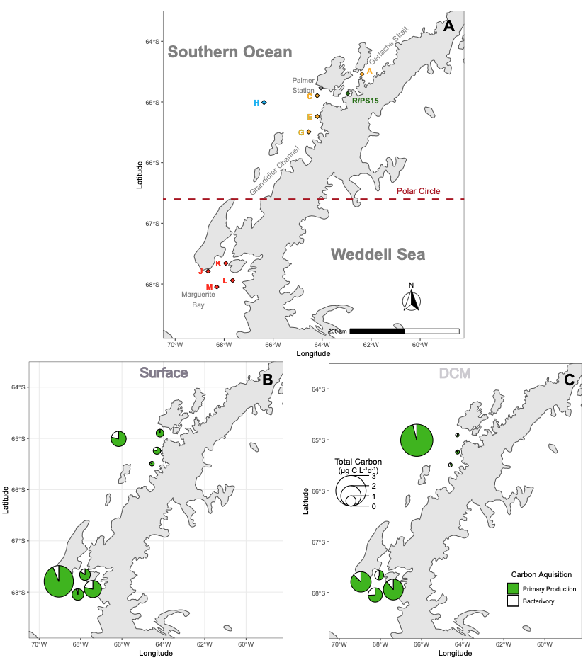

# Dr. Christopher Carnivale, Ph.D.

Welcome to my data analyst/scientist portfolio highlighting all of my most relevant work, especially my Ph.D. dissertation. Throughout you will find quick summaries of all of my work with links to the repositories where you can delve deeper into the statistics and programming I utilized to address important ecological or business questions and their solutions. Also, the linked individual subpages are visual notebooks of all of my work into each project (mostly R markdown). Finally, you can find my published dissertation [here](placeholder link).

## Introduction
I am a recent Ph.D. graduate from Temple University's Biology Program. I successfully defended my dissertation December 11,2024, and currently looking for work. Throughout my life, I have been drawn to solving puzzles and uncovering solutions. With a background in ecology and applying data science, I am passionate about applying these skills to tackle complex questions and challenges. I am currently seeking opportunities to leverage my expertise and problem-solving mindset to support and enhance your company's success.

In my PhD dissertation work, I developed novel methods to:  (1) estimate mixotrophic (both phagocytic and photosynthetic) nanoplankton importance to the Southern Ocean, (2) assess the extent of bathymetrical and seasonal variation in microplastic pollution in the Southern Ocean, and (3) understand the impact microplastics have on the nanoplanktonic community.

### Chapter 1: Bacterivory and production of nanoflagellates off the Western Antarctic Peninsula (WAP) with a focus on mixotrophy.

#### Summary
This chapter summarises the work of my first Antarctic research voyage during the late austral spring (October - December 2019). This project aimed to investigate the role and importance of mixotrophic (both consumers and primary producers) microscopic protists within the Southern Ocean, specifically the Western Antarctic Peninsula (WAP). Mixotrophs were present throughout the WAP Region and were significant contributors to nanoflagellate primary production and bacterivorous consumption with up to 75% contribution to each depending on sampling location. The community within the region was also found to mostly photosynthetic using a novel approach I developed within this study. Initial results were presented as a 15 minute talk as a speaker during the 2022 **ASLO** conference.

[Github](https://github.com/ccarnivale/Antarctic_mixotrophy) [Webpage](https://ccarnivale.github.io/Carnivale.github.io/Southern_Ocean_Mixotrophy/)

### Chapter 2: Microplastic distribution within the Southern Ocean water column along bathymetrical and temporal gradients.

Utilizing samplings from both the first and second research cruises (late austral spring 2019 and early winter 2022), I determined the extent of microplastic (plastic < 5 mm) pollution. This is the first study to incorporate both temporal and bathymetrical gradients and multiple size fractions (> 100 µm, 100 > x > 20 µm, and 20 µm > x < 0.22 µm), for the first time within the WAP Region. Using the OpenSpecy microplastic spectral library of over 45,000 different compounds containing both plastic and non-plastic spectra, I was able to identify 5 different microplastic polymers in the Southern Ocean at concentrations similar to those of open ocean. Microplastic distribution is largely determined by the size class examined. Continued investigation is needed to help determine the abiotic or biotic factors determining the dispersal of microplastic pollutants within the region.

[Github](https://github.com/ccarnivale/Antarctic_microplastic_identification_analysis) [Webpage](placeholder)

### Chapter 3: Physiological Response of a Mixotrophic Protist (*Ochromonas* sp.) to Microplastics over a week.

To further our understanding of how microplastic pollution may interact and impact microbial communities, I assessed the reponses of a mixotrophic protist (*Ochromonas* sp.) over the course of a week-long exposure experiment. Additionally, to tease whether the impacts of microplastics are from the plastic particle or potentially harmful leaching compounds, both a direct and indirect assessment were conducted. Together, results indicate significant reduction of mixotrophic bacterivorous behavior with no significant changes to primary production or growth in both direct and indirect conditions. These results suggest the possibility for significant changes to carbon flow within the microbial food web by weakening the flow of bacterial production into the traditional greater food web, which is of critical ecological importance in the Southern Ocean.

[Github](https://github.com/ccarnivale/Mixotrophy_microplastic_physiological_responses) [Webpage](placeholder)

### Freelance Data Analytics
#### MPG Docs - Full Stack Services

I monitor the financial health and employee productivity of a locally run, small healthcare business in South New Jersey. To date, my work has resulted in a weekly reduction of 10 hours per work week in reporting time, 7% reduction to >120 day Accounts Receivable, and 20% increased efficiency in provider billing. Due to federal regulations and privacy guidelines, I will only be providing analysis of simulated datasets and I am currently working on creating shareable python scripts with simulated data.
